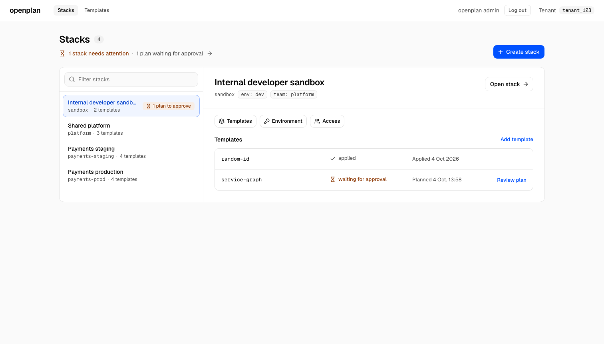
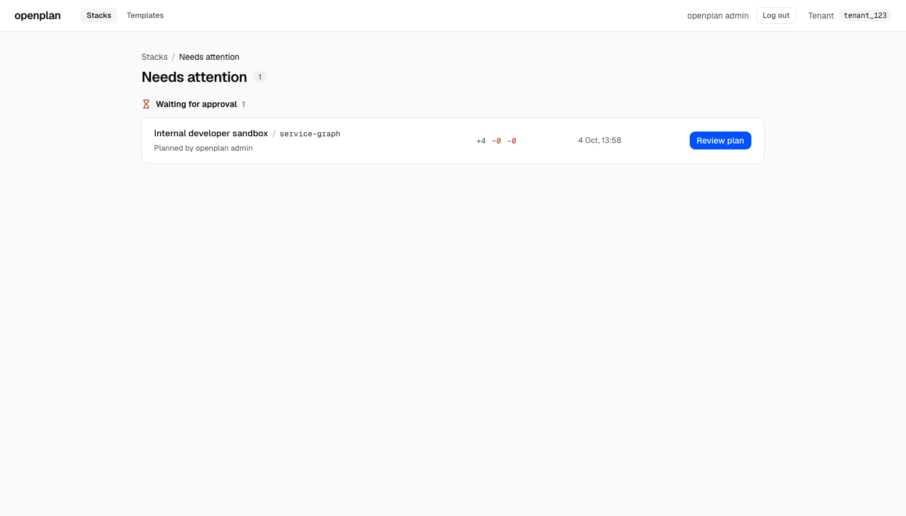
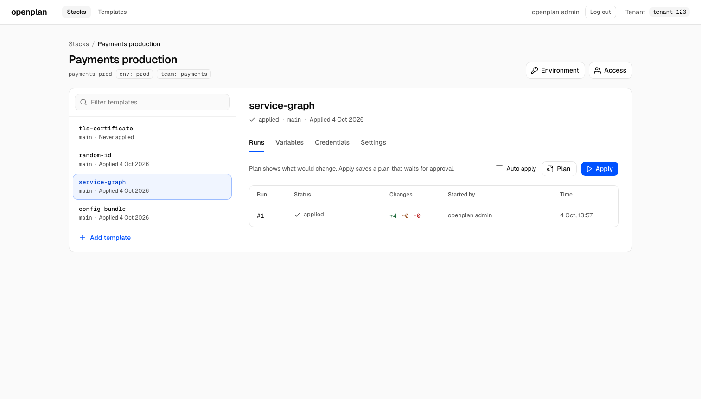
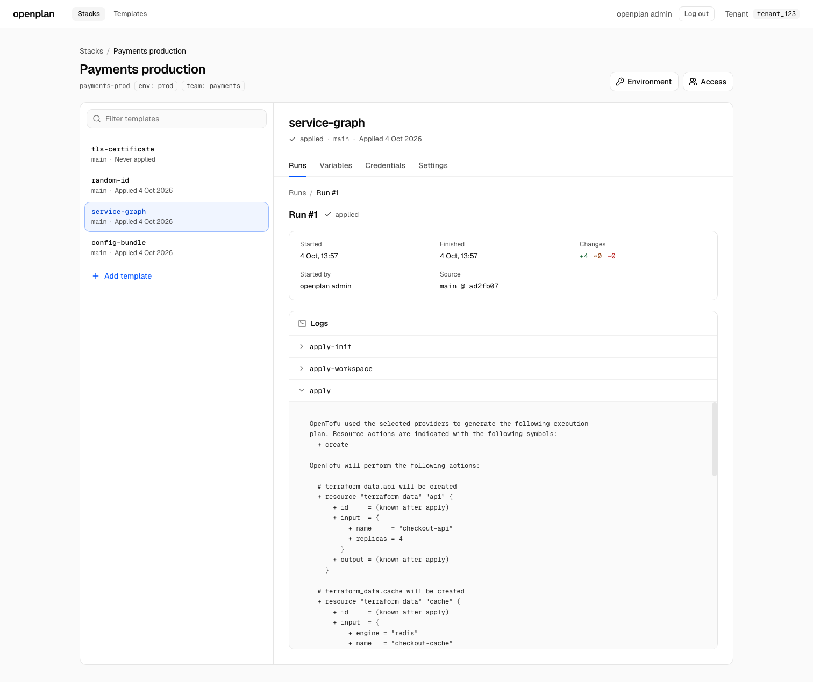
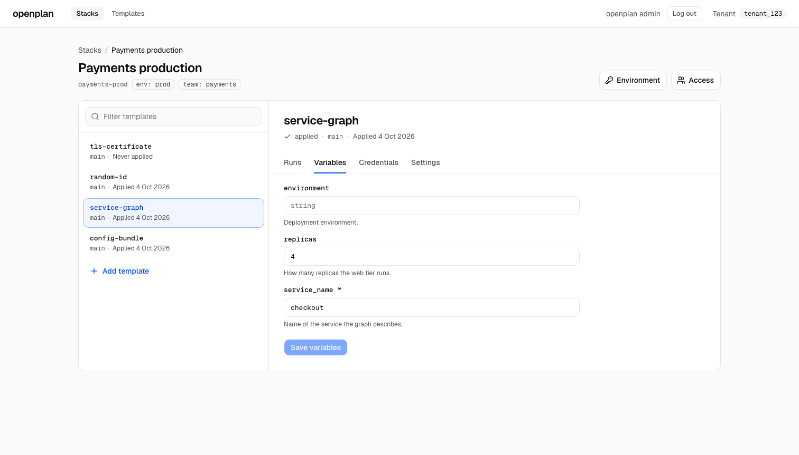
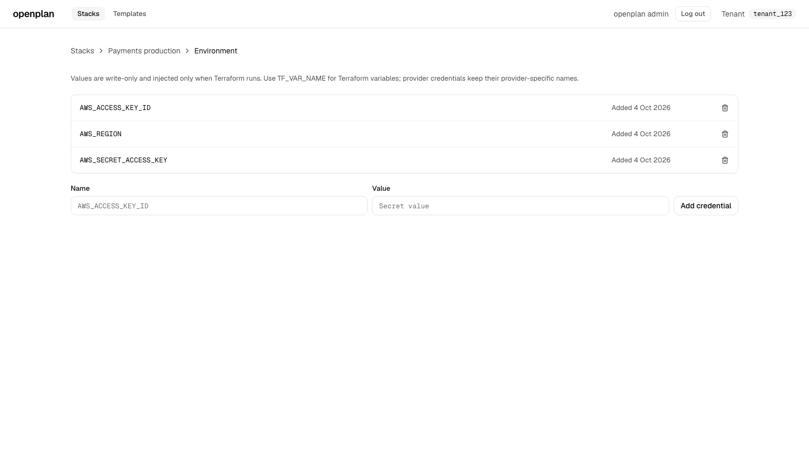
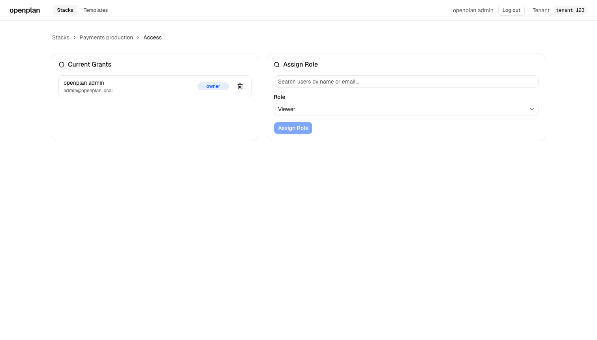
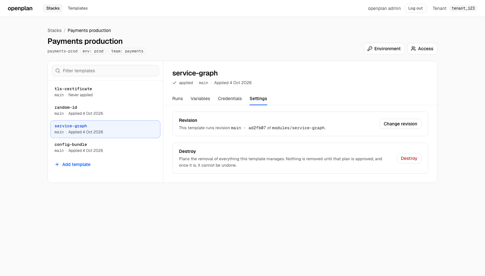

# openplan

**A self-hosted, open-source alternative to Terraform Cloud.** Register a
Terraform or OpenTofu module once, and anyone on your team can stand up their
own copy of it from a web UI, with their own variables, their own credentials,
and a full history of every change.

[](https://github.com/openplanhq/openplan/actions/workflows/ci.yml)
[](https://github.com/openplanhq/openplan/actions/workflows/differential.yml)
[](LICENSE)
[](go.mod)
[](web/package.json)

> [!WARNING]
> openplan is not production ready. It is an MVP baseline intended for local
> development, evaluation, and continued hardening. See
> [Maturity](#maturity) for what is and isn't finished.

## Why not Terraform Cloud

HCP Terraform (formerly Terraform Cloud) bills on **resources under
management**, which means every managed resource in your state costs money every
month whether or not you change it, metered hourly against your peak count. As
of 2026 that runs from $0.10 per resource per month on Essentials to $0.99 on
Premium, and the legacy always-free tier reached end of life in March 2026.

openplan runs on your own Postgres and Temporal. There is no per-resource
meter, and OpenTofu and Terraform are on equal footing with no licence questions
in between.

|                                              | **openplan**        | HCP Terraform  | Atlantis        | Terragrunt  |
| -------------------------------------------- | ------------------- | -------------- | --------------- | ----------- |
| **Self-hosted**                                | Yes, Apache 2.0     | Enterprise only | Yes             | Yes         |
| **Billed per managed resource**                | No                  | Yes            | No              | No          |
| **Web UI for non-infra engineers**             | Yes                 | Yes            | No, PR comments | No, a CLI   |
| **Per-stack access control**                   | Yes, OpenFGA        | Project-level  | Repo-level only | No          |
| **SSO**                                        | Any OIDC/LDAP       | Yes            | Bring your own  | No          |
| **Run history and log retention**              | Yes, durable        | Yes            | Yes             | Yes         |
| **Approval gates before apply**                | Yes                 | Yes            | Yes             | No          |
| **Terraform *and* OpenTofu**                   | Yes, first-class    | Yes            | Yes             | Yes         |
| **Workflow engine**                            | Temporal, so you can self-host it or run it on Temporal Cloud | Built in | No | No |
| **Cost**                                       | Your infrastructure | Per resource   | Free            | Free / paid |

Each of the others solves a different problem, and none of this is an argument
against them:

- **Atlantis** is excellent pull-request automation. It has no product UI, so a
  platform team cannot offer self-service without building one on top.
- **Terragrunt** is a CLI layer that removes repetition and adds a run queue. It
  is not a service with an authorization model.
- **Terraform Enterprise** is the real self-hosted comparison, and the one worth
  benchmarking against if openplan's feature set does not cover you yet.

### Running on Temporal Cloud

openplan's runs are Temporal workflows, and the API and executors connect to
whatever cluster `TEMPORAL_ADDRESS` points at. That means you can host the API
and the database yourself and let a managed Temporal cluster do the durable
execution, instead of running one.

Temporal Cloud is priced per action rather than per resource, so it does not
inherit Terraform Cloud's billing problem. It starts at $50 per million actions
with $150 in credits, storage is $0.042/GB-hour active and $0.00105/GB-hour
retained, and the Developer plan has no base monthly fee. For an infrastructure
platform the action count tracks runs, not resource count, so the bill stays
small next to a per-resource meter.

> [!NOTE]
> Connecting to Temporal Cloud today needs a small change: openplan's Temporal
> client sets only `HostPort` and `Namespace`
> ([internal/temporal/client.go](internal/temporal/client.go)), so it speaks
> plaintext and sends no API key. Temporal Cloud requires TLS and an API key.
> Self-hosting Temporal works as-is. See
> [#301](https://github.com/openplanhq/openplan/issues/301).

## What it does

- **Register templates.** Point openplan at a Git repository and a revision. That
  becomes a reusable template anyone on the platform can install.
- **Compose stacks.** A stack groups the templates that make up one environment
  or one service, each with its own configuration.
- **Configure per stack.** Set input variables and attach cloud credentials
  without editing anyone's Terraform.
- **Plan, apply and destroy from the browser.** Runs are durably orchestrated on
  Temporal, so a plan or apply survives a restart rather than being lost halfway.
- **Watch runs and read logs.** Every run keeps its `init`, `plan` and
  `workspace` output, and its history.
- **Upgrade deliberately.** When a template gets a new revision, upgrade a stack
  to it as an explicit, reviewable step instead of drifting silently.
- **Control access per stack.** Grant people access to the stacks they need,
  rather than to everything.
- **Sign in with SSO.** openplan signs in through [Dex](https://dexidp.io), its
  identity provider in every deployment. A corporate IdP, GitHub, or LDAP plugs
  in as a Dex connector, and the local stack ships Dex preconfigured, so there
  is nothing to wire up to try it.

Signed-in sessions are openplan's own record, bounded by its own absolute and
idle timeouts rather than by Dex's token lifetime. See
[Authentication and Authorization](docs/authentication.md) for the session
model and logout.

## Screenshots

**Stacks.** Everything a team has running, in one list, with anything waiting on
a person called out.


**What needs attention.** Plans waiting for approval and destroys that failed,
across every stack you can see.



**Templates and runs.** The templates a stack is built from, the plan and apply
controls, and the run history, all on one screen.



**Runs and logs.** Every run keeps its status, its timings, and the full `init`,
`plan` and `workspace` output.



**Variables.** The input variables openplan inferred from the module, editable
per stack.



**Credentials.** Cloud credentials are write-only and injected only while
Terraform runs.



**Access.** Grant people a role on the stacks they need, not on everything.



**Settings.** Which revision a stack is on, which one it has applied, and where
it differs.



## Running it locally

Requires Docker. No Go or Node toolchain.

### The quick way

One file, no checkout:

```bash
curl -O https://raw.githubusercontent.com/openplanhq/openplan/v0.2.0/docker-compose.release.yaml
curl -O https://raw.githubusercontent.com/openplanhq/openplan/v0.2.0/deploy/release/dex.yaml
curl -O https://raw.githubusercontent.com/openplanhq/openplan/v0.2.0/deploy/release/init-databases.sh
docker compose -f docker-compose.release.yaml up -d
```

That pulls published images pinned to a release, so nothing is built. It needs
the two small files beside it because Dex's configuration and the database
init step cannot live inside a Compose file; there is no `127.0.0.1` trap in
this path, the issuer is already configured.

### From a checkout

For working on openplan rather than running it:

```bash
git clone https://github.com/openplanhq/openplan.git
cd openplan
cp .env.example .env
docker compose up -d --wait
```

That pulls prebuilt images from GHCR, so it takes a minute or two rather than
building the Go and Node toolchains. If a pull is unavailable, Compose falls
back to building from source on its own, which works but takes longer.

There is no second step. OpenFGA runs inside the API, which creates its tables
in the application database and resolves the store and authorization model from
the model in this repository at startup. Nothing has to be recorded between
phases, and nothing has to be pasted into `.env`.

**Then open http://localhost:5173** and sign in through Dex as
`admin@openplan.local` / `admin-local-only`. That user is root: the API grants
the platform `root` relationship to its `sub` (`OPENPLAN_ROOT_SUBJECT`) at every
boot.

> [!IMPORTANT]
> Use `localhost`, not `127.0.0.1`. The redirect URI is derived from a single
> `OPENPLAN_PUBLIC_URL`, so only that exact origin is registered with an
> identity provider — `127.0.0.1` fails OIDC sign-in with an invalid
> `redirect_uri`.

### Pinning a version, and building from source

`docker compose up` runs `latest`, which is the latest release. To pin a
specific version, set it in `.env`:

```bash
OPENPLAN_IMAGE_TAG=0.1.0
```

If you are changing openplan itself rather than running it, build from source so
a published image cannot shadow your edit:

```bash
OPENPLAN_PULL_POLICY=build docker compose up -d --build
```

### Try it with the demo templates

[`openplanhq/demo-templates`](https://github.com/openplanhq/demo-templates)
holds small Terraform modules that need **no cloud credentials**. They use
only the built-in `terraform_data` resource and the `random`, `tls` and `local`
providers. Register one, install it into a stack, and a real plan and apply will
run end to end without an AWS account.

### Stopping it

```bash
docker compose down
```

### Starting over

To wipe everything and begin from a clean slate:

```bash
docker compose down -v
docker compose up -d --wait
```

### Optional extras

```bash
docker compose --profile s3 up -d      # MinIO, for S3-backed artifacts
docker compose --profile debug up -d   # Temporal UI on http://localhost:8080
```

> [!NOTE]
> **Upgrading an existing local stack?** Run `docker compose down -v` before
> starting it back up. OpenFGA's tables moved out of their own database and
> into the application database, so tuples written before the move are not
> carried over. Dex's database is created only when Postgres initializes an
> empty volume, so on an old volume Dex cannot start, and the API waits on it.
> Grants held by the old `root` local account do not carry over either: root
> is now a Dex user.

## Maturity

An MVP baseline, and honest about it. What that means in practice:

- **Works end to end today:** template registration, stacks, per-stack
  variables and credentials, plan/apply/destroy with durable runs on Temporal,
  full run logs, per-stack authorization through OpenFGA, SSO through Dex.
- **Not finished:** no upgrade path between releases yet, no audit log UI, no
  drift detection, no policy-as-code. The open issue tracker is the source of
  truth for what is planned. It is actively worked, and issues closed in the
  last month are visible in the history.

## Documentation

- [Local development](docs/development.md) - running openplan from source
- [Architecture and product model](docs/architecture.md)
- [Authentication and authorization](docs/authentication.md)
- [API reference](docs/openapi.yaml)

## Contributing

See [CONTRIBUTING.md](CONTRIBUTING.md). `make lint` and `go test ./...` from the
repository root, `npm test` and `npm run build` from `web/`. CI runs all four.

## License

[Apache 2.0](LICENSE).